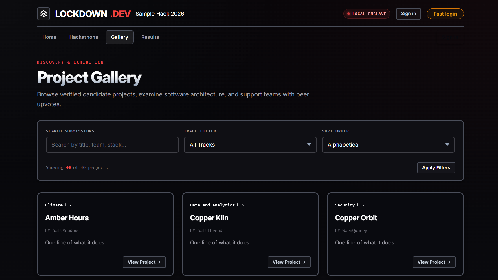
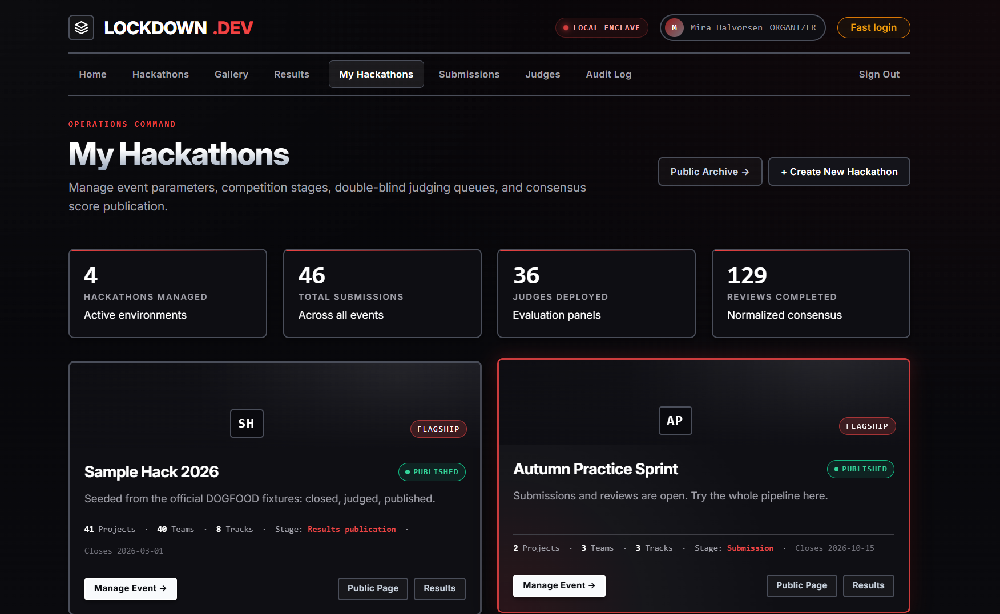
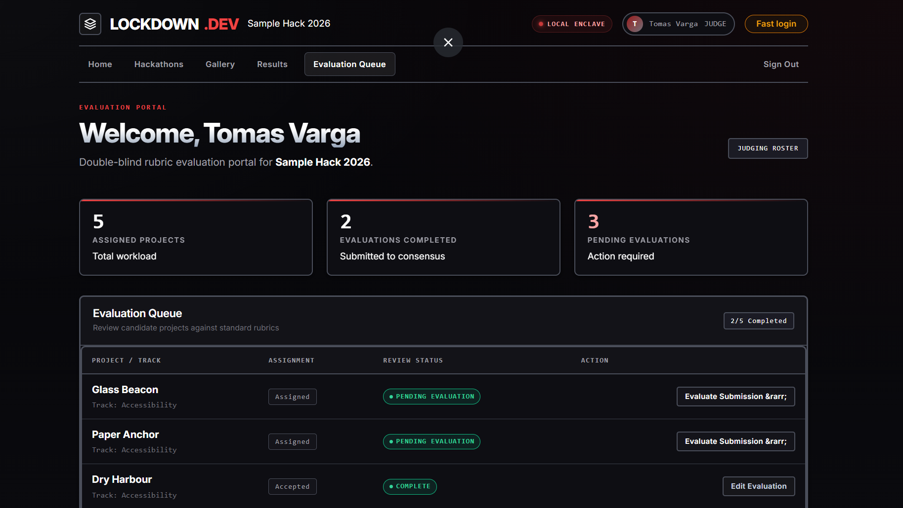
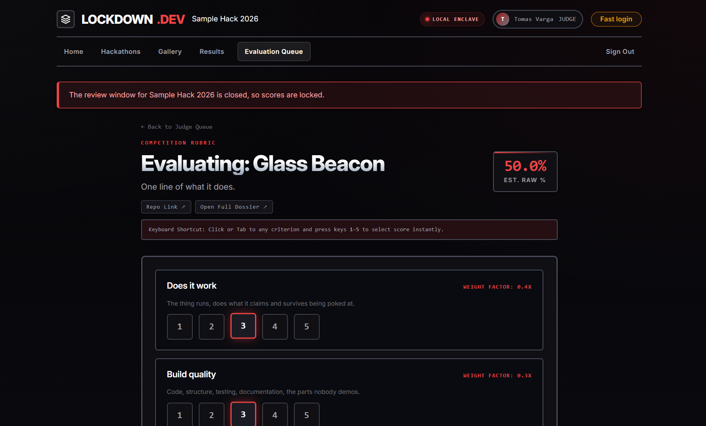
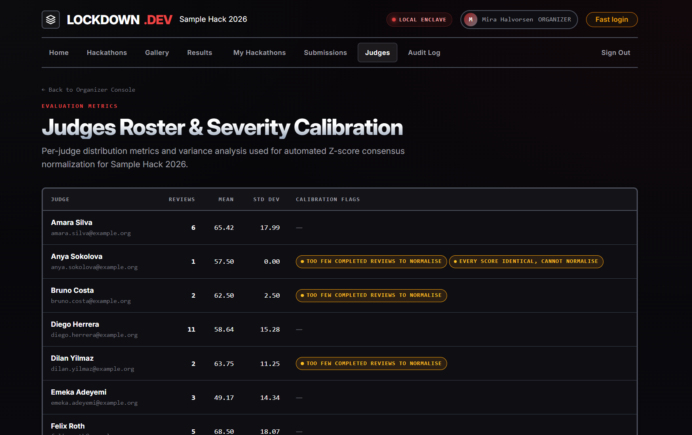
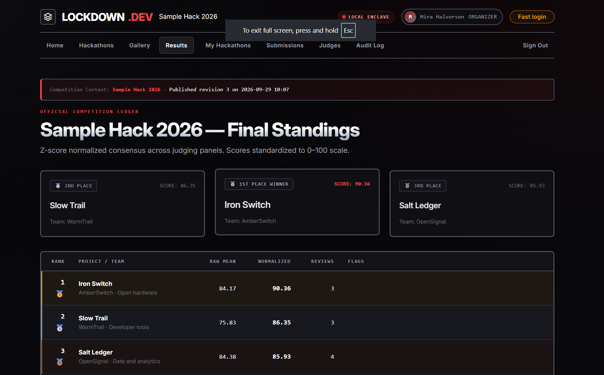
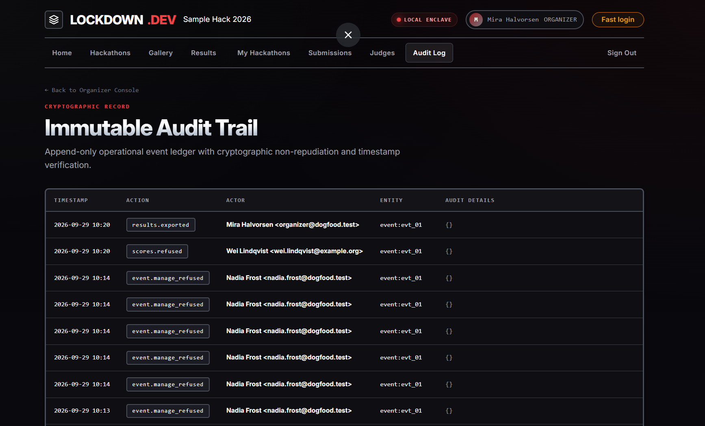
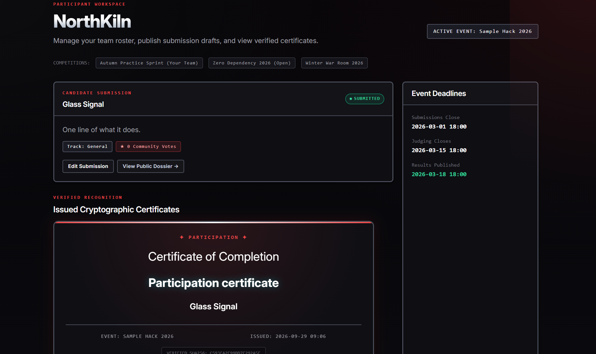

<p align="center">
  
</p>

<h1 align="center">Lockdown</h1>

<p align="center">
  <strong>A self-hosted submission, judging and results portal for hackathons.</strong><br>
  One command. One SQLite file. Zero third-party dependencies. Zero outbound network calls.
</p>

<p align="center">
  <a href="https://www.python.org/"></a>
  <a href="#zero-dependency-by-construction"></a>
  <a href="DATA-MODEL.md"></a>
  <a href="ARCHITECTURE.md"></a>
  <a href="acceptance-report.txt"></a>
  <a href="#offline-by-default"></a>
  <a href="LICENSE"></a>
</p>

<p align="center">
  <a href="#-60-second-evaluation">Quick start</a> ·
  <a href="#-acceptance-suite">Acceptance suite</a> ·
  <a href="#-visual-tour">Visual tour</a> ·
  <a href="#-capability-tour">Capabilities</a> ·
  <a href="#-architecture-at-a-glance">Architecture</a> ·
  <a href="#-documentation-sitemap">Docs</a>
</p>

---

## Overview for evaluators

**Lockdown** is a complete competition operating system for hackathons: it takes a hackathon from an empty install to a published, certified leaderboard without a database server, message queue, CDN, API key or a single `pip install`.

Built entirely on the Python standard library (`http.server`, `sqlite3`, `hashlib`, `hmac`, `secrets`), the Docker image installs nothing and the running portal opens zero outbound connections.

| Feature | Guarantee |
| --- | --- |
| **One install, many hackathons** | `/events` serves as a public directory. Each hackathon has its own cover, gallery, rubric and results. Organizer access is strictly scoped per event. |
| **Deadlines enforced in the API** | The submission window is validated on every state mutation. Closed events refuse submissions at the handler level. |
| **Blind judging with strict isolation** | Judges can read only their own evaluations. Refusals are enforced in handlers, not merely hidden in HTML. |
| **Statistically fair scoring** | Cross-judge z-score normalization rescales harsh and generous judges onto a common distribution with explicit sample-size fallbacks. |
| **Frozen, auditable results** | Publishing creates an immutable JSON snapshot with a SHA-256 checksum, issues verifiable certificates, and writes to an append-only audit ledger. |
| **Complete audit trail** | Every authentication, refusal, score, publication and data export is synchronously recorded in `audit_log`. |

---

## 🚀 60-second evaluation

### Option A — Docker Compose (Recommended)

```bash
docker compose up
```

Builds the image, sets up the volume, seeds the database from `fixtures.json`, and serves on **<http://127.0.0.1:8081>**.

The boot banner prints ready-to-use session cookies:

```text
seeded. test logins:
  organizer      Cookie: session=sess_org_3f9a21c4
  judge_a        Cookie: session=sess_jdg_a_91bc4730
  judge_b        Cookie: session=sess_jdg_b_44de8a12
  participant    Cookie: session=sess_prt_2e8877ab
```

| Route | View |
| --- | --- |
| <http://127.0.0.1:8081/gallery> | Public project gallery |
| <http://127.0.0.1:8081/events> | Multi-hackathon directory |
| <http://127.0.0.1:8081/results> | Published standings and leaderboards |
| <http://127.0.0.1:8081/login> | Sign-in (`organizer@dogfood.test` / `dogfood-demo-2026`) |

```bash
docker compose ps          # Check status
docker compose down        # Stop container (preserves database)
docker compose down -v     # Reset database and clean up
```

### Option B — Python direct (Zero dependencies)

Requires Python 3.12+. No packages to install:

```bash
python3 -m app             # Serves at http://localhost:8081
python3 -m app --reset     # Reset and re-seed database
```

### Option C — Proving air-gapped offline operation

The portal never imports an HTTP client and loads zero external assets. Verify on an isolated network:

```bash
docker compose -f docker-compose.yml -f docker-compose.offline.yml up -d
docker compose -f docker-compose.yml -f docker-compose.offline.yml exec -T portal python3 run.py .dogfood.toml
docker compose -f docker-compose.yml -f docker-compose.offline.yml down
```

---

## ✅ Acceptance suite

The official DOGFOOD 2026 checker (`run.py`) verifies all claimed capabilities over HTTP:

```bash
# Against running container
docker compose exec portal python3 run.py .dogfood.toml

# Or from host
python run.py .dogfood.toml
```

| Tier | Requirement | Probe | Status |
| :---: | --- | --- | :---: |
| **T1** | Public gallery is browsable anonymously | `T1 gallery is public` | **PASS** |
| **T1** | Gallery renders real fixture projects | `T1 project from fixtures shown` | **PASS** |
| **T1** | A closed event refuses submissions | `T1 closed event refuses submissions` | **PASS** |
| **T2** | A judge can read their own scores | `T2 judge sees own scores` | **PASS** |
| **T2** | A judge **cannot** read a peer's scores | `T2 judge cannot see peer scores` | **PASS** |
| **T2** | A participant is not a judge | `T2 participant blocked` | **PASS** |
| **T2** | An organizer can export standings as CSV | `T2 csv export works` | **PASS** |

<details>
<summary><strong>View <code>acceptance-report.txt</code> output</strong></summary>

```text
DOGFOOD 2026 acceptance report
portal: http://localhost:8081
claimed: T1 T2
fixtures: fixtures.json

T1  gallery is public ................. PASS
T1  project from fixtures shown ....... PASS
T1  closed event refuses submissions .. PASS
T2  judge sees own scores ............. PASS
T2  judge cannot see peer scores ...... PASS
T2  participant blocked ............... PASS
T2  csv export works .................. PASS

claimed T1 T2, verified T1 T2
```

</details>

Unit tests for multi-hackathon isolation and migrations:

```bash
python -m unittest discover -s tests
```

---

## 🖼️ Visual tour

Every page is server-rendered HTML with zero client framework overhead. JavaScript is used strictly for progressive enhancements (countdowns, autosave, shortcuts).

### 1. Homepage — Event identity, live numbers, stage rail

The landing page features the active competition's identity, live metrics, a six-stage pipeline rail, and recent submissions.

<p align="center">
  
</p>

*Figure 1 — Homepage (`/`): event metrics, the stage pipeline, and recent submissions.*

### 2. Public gallery — Browsable with no account

Visitors browse all non-superseded submissions with real-time track filtering, search, sorting options, and paginated project cards.

<p align="center">
  
</p>

*Figure 2 — Public gallery (`/gallery`): track filters, search, and submission cards.*

### 3. Organizer desk — Hackathon control center

Per-event management dashboard showing current stage status, key metrics, judge assignments, and administrative shortcuts.

<p align="center">
  
</p>

*Figure 3 — Management overview (`/organizer/events/{event_id}`): stage controls, metrics, and event actions.*

### 4. Judge workspace — Assignments and progress

Judges see only the projects assigned to them across their events, tracking completed evaluations and pending reviews.

<p align="center">
  
</p>

*Figure 4 — Judge portal (`/judge`): assignment queue, review progress, and evaluated submissions.*

### 5. Evaluation form — Weighted rubric with autosave

Scoring against custom weighted criteria with draft autosave, 1–5 keyboard shortcuts, and reviewer feedback fields.

<p align="center">
  
</p>

*Figure 5 — Evaluation form (`/judge/evaluate/{project_id}`): weighted criteria scoring, autosave, and notes.*

### 6. Judge calibration roster — Statistical normalization inputs

Organizers inspect per-judge averages, standard deviations, and severity classifications feeding the z-score engine.

<p align="center">
  
</p>

*Figure 6 — Judge calibration (`/organizer/judges`): judge scoring distribution and severity labels.*

### 7. Published results — Frozen, checksummed leaderboard

Standings published from an immutable JSON snapshot with SHA-256 verification, preventing retroactive score changes.

<p align="center">
  
</p>

*Figure 7 — Published ledger (`/results`): immutable standings, raw and normalized scores.*

### 8. Audit trail — Append-only, per-event logging

Every authentication, submission rejection, score submission, publication, and export logged synchronously with actor timestamps.

<p align="center">
  
</p>

*Figure 8 — Audit trail (`/organizer/events/{event_id}/audit`): verified append-only log of all actions.*

### 9. Participant workspace — Team, submission, certificates

Participant portal displaying registered team members, submission deadline state, and cryptographic achievement certificates.

<p align="center">
  
</p>

*Figure 9 — Participant workspace (`/participant`): team roster, submission status, and certificates.*

---

## 📊 The numbers

| Metric | Value | Where it comes from |
| --- | ---: | --- |
| Runtime third-party dependencies | **0** | `app/` imports only standard library modules |
| Install steps | **0** | `Dockerfile` runs no package manager |
| Outbound network calls | **0** | No HTTP client exists in `app/` |
| HTTP route registrations | **58** | 37 GET, 21 POST in `app/routes.py` |
| SQLite tables | **31** | `app/schema.sql` (schema version 2) |
| Processes / services | **1** | Single `python -m app` server |
| Database files | **1** | `data/portal.sqlite3` with WAL/SHM |
| Seeded hackathons | **3** | Sample Hack 2026, Autumn Practice Sprint, Zero Dependency 2026 |
| Seeded projects | **48** | 41 fixture + 3 practice + 4 demo |
| Seeded evaluations | **129** | Complete review dataset |
| DOGFOOD tiers verified | **T1 + T2** | 7/7 probes passed ([`acceptance-report.txt`](acceptance-report.txt)) |

---

## 🧭 Capability tour

### Public surfaces — No account required
- `GET /` — Event landing with metrics, stage pipeline, and recent projects.
- `GET /gallery` — Public exhibition with track filters, search, and sorting.
- `GET /gallery/{project_id}` — Dossier with version history and comments.
- `GET /events` — Multi-hackathon directory of published events.
- `GET /results` — Published standings; renders empty table under embargo.

### Participants — One team, one submission
- Team creation during the registration window (`POST /participant/team/create`).
- Draft and iterate on submissions (`GET|POST /participant/project/new`, `/participant/project/edit`).
- Revisions append to `project_versions` without overwriting history.
- Strict deadline enforcement returning `403` and logging to `audit_log` when closed.

### Judges — Assigned projects and isolated scores
- Assignment queue across assigned hackathons (`GET /judge`).
- Rubric scoring with autosave and 1–5 keyboard shortcuts (`GET|POST /judge/evaluate/{project_id}`).
- Scored reviews are versioned into `review_revisions` and signed with HMAC-SHA256.
- Strict peer isolation: accessing another judge's score returns `403 peer_scores_forbidden`.

### Organizers — Scoped event administration
- Dashboard of managed hackathons (`GET /organizer`).
- Create and configure hackathons, stages, tracks, prizes, and rubrics (`GET|POST /organizer/events/new`).
- Handlers verify `events.can_manage()` before accessing records.
- Freeze and publish results with SHA-256 snapshots (`POST /organizer/events/{event_id}/results`).
- Filterable append-only audit ledger (`GET /organizer/events/{event_id}/audit`).

### Scoring — Explainable z-score normalization
- Weighted criteria normalized to sum to `1.0`.
- Scores normalized across judges to `μ = 75.0`, `σ = 12.0` to balance harsh and lenient graders.
- Clear fallbacks: under 3 reviews or zero variance falls back safely to raw scores.
- Detailed formulas and worked examples documented in **[JUDGING.md](JUDGING.md)**.

---

## 🏗️ Architecture at a glance

```text
python -m app
   │
   ├── db.init_db()          app/db.py       Apply schema.sql and migrations
   ├── boot.seed()           app/boot.py     Seed fixtures, demo events, and logins
   └── server.serve()        app/server.py   ThreadingHTTPServer.serve_forever()
```

- **One process, multi-threaded:** Standard library `ThreadingHTTPServer` with daemon worker threads.
- **Thread-local SQLite:** One connection per thread with WAL mode, `busy_timeout=10000`, and `RLock` transactions.
- **Request pipeline:** 2 MiB payload limit, static file cache, route matching, session hashing, role verification, CSRF validation, and standard security headers (`CSP`, `nosniff`, `DENY`).

### Module map

| Module | Responsibility |
| --- | --- |
| `app/__main__.py` | CLI parsing and bootstrap coordination |
| `app/config.py` | Configuration and environment variables |
| `app/schema.sql` | 31 SQLite tables and indices |
| `app/db.py` | Connection pooling and parameterised transactions |
| `app/migrations.py` | Additive, idempotent schema upgrades |
| `app/http.py` | Request/Response parsing and Router |
| `app/server.py` | HTTP pipeline, guards, and static serving |
| `app/routes.py` | 58 route registrations |
| `app/auth.py` | Session management and role authorization |
| `app/security.py` | scrypt/PBKDF2 hashing and HMAC verification |
| `app/events.py` | Hackathon lifecycles and deadline checks |
| `app/eventadmin.py` | Event creation and administration |
| `app/scoring.py` | Rubric scoring and z-score normalization |
| `app/results.py` | Publication snapshots, certificates, advancements |
| `app/audit.py` | Synchronous append-only audit logger |
| `app/views/` | HTML string builders with automatic escaping |

---

## 🧱 Zero dependency by construction

The application imports only Python standard library modules:
`http.server`, `sqlite3`, `hashlib`, `hmac`, `secrets`, `urllib.parse`, `json`, `re`, `math`, `datetime`, `threading`, `os`, `pathlib`, `csv`, `html`, `dataclasses`, `collections`, `mimetypes`.

The frontend requires no build steps or bundlers. `app/views/static/app.js` progressively adds deadline countdowns, autosave via `fetch`, and keyboard navigation.

---

## 🔌 Offline by default

- **No HTTP client:** No external network libraries are imported in `app/`.
- **Self-contained assets:** All styles, scripts, and fonts are served locally from `/static/`.
- **Zero telemetry:** No external analytics or tracking exist.
- **Verified air-gap:** Passes acceptance test suite on Docker networks with `internal: true`.

---

## ⚙️ Configuration reference

| Variable | Default | Meaning |
| --- | --- | --- |
| `PORTAL_HOST` | `0.0.0.0` | Bind interface inside container |
| `PORTAL_PORT` | `8081` | Port to serve on |
| `LOCKDOWN_PORT` | `8081` | Host port mapped by Docker Compose |
| `PORTAL_BASE_URL` | `http://localhost:$PORTAL_PORT` | Absolute base URL for links |
| `PORTAL_PRIMARY_EVENT` | `sample-hack-2026` | Default hackathon for public views |
| `PORTAL_DATA_DIR` | `./data` (`/data` in Docker) | SQLite storage directory |
| `PORTAL_FIXTURES` | `./fixtures.json` | Fixtures for seeding empty database |
| `PORTAL_FAST_LOGIN` | `0` | One-click demo sign-in (1 to enable) |
| `PORTAL_TARGET_REVIEWS` | `3` | Target reviews per project |
| `PORTAL_DEMO_PASSWORD` | `dogfood-demo-2026` | Password for demo accounts |

More configuration details: **[OPERATIONS.md](OPERATIONS.md)**.

---

## 👤 Demo credentials

All demo accounts use password `dogfood-demo-2026`:

| Role | Email | Session cookie |
| --- | --- | --- |
| **Organizer** | `organizer@dogfood.test` | `session=sess_org_3f9a21c4` |
| **Admin** | `admin@dogfood.test` | `session=sess_adm_6c02ff31` |
| **Judge A** | `tomas.varga@example.org` | `session=sess_jdg_a_91bc4730` |
| **Judge B** | `wei.lindqvist@example.org` | `session=sess_jdg_b_44de8a12` |
| **Participant** | `priya1@example.org` | `session=sess_prt_2e8877ab` |
| **Organizer B** | `nadia.frost@dogfood.test` | `session=sess_org_b_7c31de84` |

Demo sessions are pre-seeded and do not expire. Fixture accounts use password `fixture-demo-2026`.

---

## 📚 Documentation sitemap

| Document | Purpose |
| --- | --- |
| **[FEATURES.md](FEATURES.md)** | Complete route inventory, guards, and capabilities. |
| **[TIER-MATRIX.md](TIER-MATRIX.md)** | Claimed vs. verified tier coverage (T1–T4). |
| **[ARCHITECTURE.md](ARCHITECTURE.md)** | System design, request lifecycle, and data isolation. |
| **[DATA-MODEL.md](DATA-MODEL.md)** | All 31 tables, foreign keys, and snapshot schemas. |
| **[JUDGING.md](JUDGING.md)** | Scoring engine formulas, z-score math, and worked examples. |
| **[SECURITY.md](SECURITY.md)** | Threat model, CSRF, session security, and authorization. |
| **[TESTING.md](TESTING.md)** | Acceptance suite, unit tests, and offline verification. |
| **[OPERATIONS.md](OPERATIONS.md)** | Deployment, persistence, backups, and operational guides. |
| **[SCREENSHOTS.md](SCREENSHOTS.md)** | Visual tour catalog and image specifications. |

---

## 📄 License

Lockdown is released under the [MIT License](LICENSE). Built for the **DOGFOOD 2026** competition brief.
