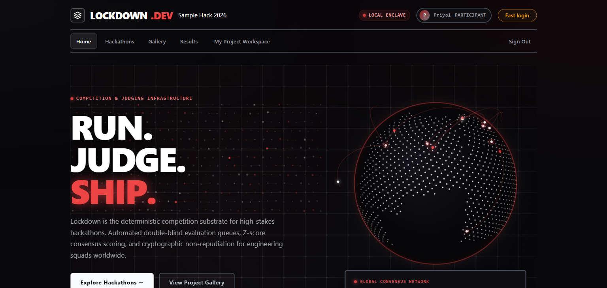

<p align="center">
  
</p>

<h1 align="center">Lockdown</h1>

<p align="center">
  <strong>A self-hosted submission, judging and results portal for hackathons.</strong><br>
  One command. One SQLite file. Zero third-party dependencies. Zero outbound network calls.
</p>

<p align="center">
  <a href="https://www.python.org/"></a>
  <a href="#zero-dependency-by-construction"></a>
  <a href="DATA-MODEL.md"></a>
  <a href="ARCHITECTURE.md"></a>
  <a href="acceptance-report.txt"></a>
  <a href="#offline-by-default"></a>
  <a href="LICENSE"></a>
</p>

<p align="center">
  <a href="#-60-second-evaluation">Quick start</a> ·
  <a href="#-acceptance-suite">Acceptance suite</a> ·
  <a href="#-visual-tour">Visual tour</a> ·
  <a href="#-capability-tour">Capabilities</a> ·
  <a href="#-documentation-sitemap">Docs</a> ·
  <a href="#-known-limitations">Limitations</a>
</p>

---

## Overview for evaluators

**Lockdown** is a competition operating system for hackathons: it takes a
hackathon from an empty install to a published, certified leaderboard without a
database server, a message queue, a CDN, an API key or a single `pip install`.

It is built on the Python standard library — `http.server`, `sqlite3`,
`hashlib`, `hmac`, `secrets` — and nothing else. The Docker build installs
nothing. The running portal opens no outbound connection.

What that buys an organizer:

| | |
| --- | --- |
| **One install, many hackathons** | `/events` is a public directory, each hackathon has its own cover, gallery, rubric and results page, and organizer access is *per event*. Two competitions in the same database never see each other's projects, scores or standings. |
| **Deadlines enforced in the API** | The submission window is checked on the POST, not merely hidden in the template. A closed event refuses submissions whether they arrive from a browser or from `curl`. |
| **Blind judging that actually refuses** | A judge can read their own evaluations and nobody else's. The refusal lives in the API handler, so hiding a table is never mistaken for isolation. |
| **Statistically fair scoring** | Cross-judge z-score normalization rescales harsh and generous judges onto a common mean and standard deviation, with explicit fallback flags when a judge has too little data to calibrate. |
| **A frozen, auditable result** | Publishing writes an immutable JSON snapshot with a SHA-256 checksum, issues certificates, and appends to an append-only audit ledger. Later edits become new revisions, never silent changes. |
| **A real audit trail** | Every sign-in, refusal, assignment, score, publication and export is appended to `audit_log` synchronously inside the caller's transaction. |

> **Evaluator shortcut.** Everything below is verifiable. `docker compose up`
> seeds a database with 41 fixture projects and three hackathons, prints four
> working session cookies, and passes the official DOGFOOD checker on the first
> run. See the [60-second evaluation](#-60-second-evaluation).

---

## 🚀 60-second evaluation

Three ways to bring it up. Pick whichever your machine already has.

### Option A — Docker Compose (one command)

```bash
docker compose up
```

That builds the image, creates the `portal-data` volume, seeds the database from
`fixtures.json` and serves on <http://127.0.0.1:8081>. The boot banner prints
ready-to-paste session cookies:

```
seeded. test logins:
  organizer      Cookie: session=sess_org_3f9a21c4
  judge_a        Cookie: session=sess_jdg_a_91bc4730
  judge_b        Cookie: session=sess_jdg_b_44de8a12
  participant    Cookie: session=sess_prt_2e8877ab
```

| Open | To see |
| --- | --- |
| <http://127.0.0.1:8081/gallery> | the public project gallery |
| <http://127.0.0.1:8081/events> | every hackathon in the install |
| <http://127.0.0.1:8081/results> | published standings |
| <http://127.0.0.1:8081/login> | sign in with `organizer@dogfood.test` / `dogfood-demo-2026` |

Container lifecycle:

```bash
docker compose ps          # health
docker compose logs -f     # follow the portal log
docker compose down        # stop, keep the database
docker compose down -v     # stop and throw the database away
```

> The **very first** build needs the `python:3.12-alpine` base image, so it needs
> network access once. Nothing else is downloaded, at build time or at boot.

### Option B — Python, no container

Any Python 3.12 interpreter. Nothing to install.

```bash
python3 -m app             # http://localhost:8081, seeds on first run
python3 -m app --reset     # wipe and re-seed
```

Same application, same port, same database directory (`./data`). On Windows,
`python3` is often the Microsoft Store placeholder — use `py -3 -m app` or
`python -m app` there.

### Option C — Proving it is offline (air-gap)

The portal makes **no outbound network calls at all**: rendered pages reference
no external assets, and `app/` never imports an HTTP client. Rather than take
that on faith, run the suite on a network with no gateway:

```bash
docker compose -f docker-compose.yml -f docker-compose.offline.yml up -d
docker compose -f docker-compose.yml -f docker-compose.offline.yml exec -T portal python3 run.py .dogfood.toml
docker compose -f docker-compose.yml -f docker-compose.offline.yml down
```

`docker-compose.offline.yml` sets `internal: true` on the container network, so
both DNS and outbound TCP fail. The acceptance suite still passes.

---

## ✅ Acceptance suite

The official DOGFOOD 2026 checker (`run.py`) talks HTTP only, so it works against
a containerised portal as happily as against a local one. It ships inside the
image, which makes it runnable with no host Python at all:

```bash
# against the running container
docker compose exec portal python3 run.py .dogfood.toml

# or against http://127.0.0.1:8081 from the host
python run.py .dogfood.toml
```

On Windows, prefer `py -3 run.py .dogfood.toml` or `python run.py .dogfood.toml`.
Inside the container (Alpine Linux) `python3` always exists.

| Tier | Requirement | Probe | Status |
| :---: | --- | --- | :---: |
| **T1** | Public gallery is browsable anonymously | `T1 gallery is public` | **PASS** |
| **T1** | Gallery renders real fixture projects | `T1 project from fixtures shown` | **PASS** |
| **T1** | A closed event refuses submissions | `T1 closed event refuses submissions` | **PASS** |
| **T2** | A judge can read their own scores | `T2 judge sees own scores` | **PASS** |
| **T2** | A judge **cannot** read a peer's scores | `T2 judge cannot see peer scores` | **PASS** |
| **T2** | A participant is not a judge | `T2 participant blocked` | **PASS** |
| **T2** | An organizer can export standings as CSV | `T2 csv export works` | **PASS** |

<details>
<summary><strong>Raw <code>acceptance-report.txt</code> output</strong> (click to expand)</summary>

```text
DOGFOOD 2026 acceptance report
portal: http://localhost:8081
claimed: T1 T2
fixtures: fixtures.json

T1  gallery is public ................. PASS
T1  project from fixtures shown ....... PASS
T1  closed event refuses submissions .. PASS
T2  judge sees own scores ............. PASS
T2  judge cannot see peer scores ...... PASS
T2  participant blocked ............... PASS
T2  csv export works .................. PASS

claimed T1 T2, verified T1 T2
```

</details>

The report is committed verbatim to [`acceptance-report.txt`](acceptance-report.txt)
and the routing it points at lives in [`.dogfood.toml`](.dogfood.toml).

Multi-hackathon behaviour has its own suites, which need no running server:

```bash
python -m unittest discover -s tests
```

- [`tests/test_event_isolation.py`](tests/test_event_isolation.py) — drafts stay
  invisible, per-event public pages never mix two hackathons, an outsider cannot
  borrow row ids from another event, every refusal lands in `audit_log`.
- [`tests/test_migrations.py`](tests/test_migrations.py) — the schema v1 → v2
  upgrade path, its idempotency, and "never invent a missing table".

Details in **[TESTING.md](TESTING.md)**.

---

## 🖼️ Visual tour

Every page below is server-rendered HTML with no client framework, no inline
script and no external asset. JavaScript is a progressive enhancement only —
with it disabled, every workflow in this portal still works.

<!-- ─────────────────────────────────────────────────────────────────────────
     SCREENSHOT SLOTS
     Drop your PNGs into  assests/screenshots/  using the filenames below,
     then delete the surrounding HTML comment for that figure.
     Full capture checklist: SCREENSHOTS.md
     ───────────────────────────────────────────────────────────────────────── -->

### 1. Homepage — event identity, live numbers, stage rail

The landing page leads with the competition's own identity: stat tiles, the
stage pipeline, and the six most recently submitted projects.

<p align="center">
  
</p>

*Figure 1 — Homepage (`/`): event metrics, the six-stage pipeline, and recent submissions.*

### 2. Public gallery — browsable with no account

Anonymous visitors get the full exhibition: track filters, free-text search,
three sort orders and pagination, scoped to one hackathon's canonical
(non-superseded) submissions.


<!--  -->
*Figure 2 — Public gallery (`/gallery`) — slot: `assests/screenshots/gallery.png`.*

### 3. Project dossier — version history and discussion

Each submission has a full dossier: team roster, append-only version history,
supersede/duplicate links and a public comment thread with voting.

<!--  -->
*Figure 3 — Project dossier (`/gallery/{project_id}`) — slot: `assests/screenshots/project_detail.png`.*

### 4. The hackathon shelf — one install, many competitions

`/events` is the directory of every published hackathon in the install, each
with its own cover card. Drafts never appear here.

<!--  -->
*Figure 4 — Event directory (`/events`) — slot: `assests/screenshots/events_directory.png`.*

### 5. Event cover page — schedule, tracks and prizes

One hackathon's public face: the stage timeline with open/closed/upcoming
states, its tracks, and its prize table.

<!--  -->
*Figure 5 — Event cover (`/events/{slug}`) — slot: `assests/screenshots/event_cover.png`.*

### 6. Organizer desk — one hackathon at a time

The per-event management overview: state, headline numbers, organizers, judges
and the next actions, all resolved through `events.can_manage()`.

<!--  -->
*Figure 6 — Management overview (`/organizer/events/{event_id}`) — slot: `assests/screenshots/organizer_overview.png`.*

### 7. Judge workspace — assignments, drafts and progress

A judge sees only the submissions they were given, in every published event
they hold work in, newest event last.

<!--  -->
*Figure 7 — Judge portal (`/judge`) — slot: `assests/screenshots/judge_dashboard.png`.*

### 8. Evaluation form — weighted rubric with autosave

Criterion-by-criterion scoring on the event's active rubric, with draft
autosave and 1–5 keyboard shortcuts. Unsubmitted drafts never count toward
standings.

<!--  -->
*Figure 8 — Evaluation form (`/judge/evaluate/{project_id}`) — slot: `assests/screenshots/evaluation_form.png`.*

### 9. Judge calibration roster — the numbers normalization uses

Organizers can see each judge's mean, standard deviation and severity
classification — the exact inputs the z-score engine consumes.

<!--  -->
*Figure 9 — Judge calibration (`/organizer/judges`) — slot: `assests/screenshots/judge_calibration.png`.*

### 10. Published results — frozen, revisioned, checksummed

Published standings come from an immutable `result_publications` snapshot, not
from a live query, so a later database change cannot silently rewrite history.

<!--  -->
*Figure 10 — Published ledger (`/results`) — slot: `assests/screenshots/results_published.png`.*

### 11. Audit trail — append-only, per-event

Every refusal, assignment, score, publication and export, filterable to one
hackathon's own rows.

<!--  -->
*Figure 11 — Audit trail (`/organizer/events/{event_id}/audit`) — slot: `assests/screenshots/audit_trail.png`.*

### 12. Participant workspace — team, submission, certificates

A builder's single page: their team, their submission's deadline state, and any
credential issued to their project.

<!--  -->
*Figure 12 — Participant workspace (`/participant`) — slot: `assests/screenshots/participant_workspace.png`.*

> **Adding the screenshots.** Put the files at the paths in each slot caption and
> delete that figure's surrounding `<!-- ... -->` comment. The capture checklist
> — which route, which viewport, what must be visible — is in
> **[SCREENSHOTS.md](SCREENSHOTS.md)**.

---

## 📊 The numbers

| Metric | Value | Where it comes from |
| --- | ---: | --- |
| Runtime third-party dependencies | **0** | `app/` imports only the standard library; there is no `requirements.txt` |
| Install steps | **0** | `Dockerfile` runs no `pip`, `npm` or `apk` install |
| Outbound network calls | **0** | no HTTP client is imported anywhere in `app/` |
| HTTP route registrations | **58** (37 GET, 21 POST) | `build_routes()`, `app/routes.py` |
| SQLite tables | **31** | `app/schema.sql` |
| Schema version | **2** (multi-hackathon) | `schema_meta`, `app/migrations.py` |
| Processes / services | **1** | `python -m app` |
| Database files | **1** (`data/portal.sqlite3` + WAL/SHM) | `app/config.py` |
| Seeded hackathons | **3** | Sample Hack 2026, Autumn Practice Sprint, Zero Dependency 2026 |
| Seeded projects | **48** (41 official + 3 practice + 4 demo) | `fixtures.json`, `app/boot.py` |
| Seeded evaluations | **129** | `reviews` |
| Seeded audit events | **4** on a fresh boot | `audit_log` |
| DOGFOOD tiers verified | **T1 + T2** (7/7 probes) | [`acceptance-report.txt`](acceptance-report.txt) |
| Documented gaps | **5**, each explained below | [Known limitations](#-known-limitations) |

---

## 🧭 Capability tour

### Public surfaces — no account required

- `GET /` — event landing: metrics, stage pipeline, recent submissions.
- `GET /gallery`, `GET /projects` — the public exhibition, with track filters,
  search, three sort orders and pagination.
- `GET /gallery/{project_id}` — a full project dossier with append-only version
  history and a comment thread.
- `GET /results` — published standings only. Before publication this page
  renders an embargo panel and the handler hands the template an **empty** table,
  so the embargo cannot be undone by editing HTML.
- `GET /events` — every published hackathon in the install.
- `GET /events/{slug}`, `/gallery`, `/results` — one hackathon's cover, its own
  projects only, and its own ledger only.

### Participants — one team, one submission, until the deadline

- Create a team inside the registration window (`POST /participant/team/create`).
- Draft and iterate on a submission (`GET|POST /participant/project/new`,
  `/participant/project/edit`, plus the `/projects/new` spec alias).
- Every save appends to `project_versions`, so the history is never overwritten.
- When the submission window closes, `POST` is refused with `403` **and** an
  `audit_log` entry — the form hiding its button is not the rule.

### Judges — only what they were assigned, only their own scores

- `GET /judge`, `/judge/assignments` — the queue across every published event
  they hold work in.
- `GET|POST /judge/evaluate/{project_id}` — rubric scoring on the event's active
  rubric. Opening a project the judge is not assigned to is refused and audited.
- Draft autosave via `fetch` (`X-Requested-With: Fetch`), plus 1–5 keyboard
  shortcuts on the score rows.
- Submitted reviews are never overwritten in place: the previous numbers are
  appended to `review_revisions` first, then signed with HMAC-SHA256.
- `GET /api/judge/scores` returns the caller's own rows. A judge passing another
  judge's identifier gets `403 peer_scores_forbidden` and an audit entry.

### Organizers — per-event membership, not a global role

- `GET /organizer` is the shelf: exactly the hackathons the caller belongs to.
- `GET|POST /organizer/events/new` creates a hackathon **and** its stages,
  tracks, prizes, rubric and the creator's `owner` membership row in one
  transaction — a half-existing hackathon is unreachable.
- Per event: `stages`, `teams`, `submissions`, `judges`, `assignments`,
  `reviews`, `results`, `audit`, `settings`, `organizers`.
- Every one of those handlers resolves `{event_id}`, then calls
  `events.can_manage()` before it reads or writes a single row. A row id in a
  URL is therefore not a capability.
- `POST /organizer/events/{event_id}/results` freezes a publication revision and
  issues certificates; earlier revisions are kept, never deleted.
- `GET|POST /organizer/events/{event_id}/settings` reconfigures identity,
  schedule, tracks, prizes, visibility switches and the rubric.
- `GET /organizer/events/{event_id}/audit` paginates that hackathon's own slice
  of the append-only ledger.

### Publishing — frozen snapshots, not live queries

When results are published:

1. `scoring.scoreboard(event)` computes the ranking for that event alone.
2. Prior publications for that event are marked `is_current = 0`.
3. The ranking is serialized into `rows_json`.
4. A SHA-256 checksum is computed over that JSON text.
5. The snapshot is inserted with an incremented `revision_no` and
   `is_current = 1`.
6. Certificates are issued and the action is appended to `audit_log`.

Organizers can then hide the public results page with a switch
(`events.results_visible`) without deleting the snapshot.

### Scoring — deterministic, per event, and explainable

- Weighted rubric criteria, normalized to sum to `1.0`.
- Raw score on a 0–100 scale, then cross-judge z-score normalization toward
  `μ = 75.0`, `σ = 12.0`.
- Fallbacks are explicit: fewer than 3 reviews → `insufficient_sample`;
  σ < 2.0 → `zero_variance`. Both fall back to the uncalibrated raw score.
- Coverage below `1.0` marks a project `provisional`.
- Superseded duplicates (e.g. `prj_07` replaced by `prj_41`) are excluded from
  ranking entirely.
- The full arithmetic — formulas, worked example, and the exact numbers for
  `rev_fx_016` — is in **[JUDGING.md](JUDGING.md)**.

---

## 🏗️ Architecture at a glance

```
python -m app
   │
   ├── db.init_db()          app/db.py       apply schema.sql, then migrations.migrate()
   ├── boot.seed()           app/boot.py     seed fixtures + practice + demo events + logins
   └── server.serve()        app/server.py   ThreadingHTTPServer.serve_forever()
```

**One process, many threads.** A `ThreadingHTTPServer` with daemon threads; one
thread handles one request from socket to response. There are no background
jobs, worker pools, schedulers or cron tasks anywhere in the codebase.

**One SQLite connection per thread**, cached in `threading.local()` and released
in a `finally:` block, so handles do not leak.

**Serialised writes, concurrent reads.** WAL mode, `synchronous=NORMAL`,
`foreign_keys=ON`, `busy_timeout=10000`. Mutations take a process-wide `RLock`
and execute inside `BEGIN IMMEDIATE`.

**The request lifecycle** (`PortalHandler.handle_request`):

| # | Step | Failure mode |
| ---: | --- | --- |
| 1 | Body cap — read at most 2 MiB | `413 Payload Too Large` |
| 2 | Static shortcut for `/static/`, traversal-safe, MIME-typed, 300 s cache | — |
| 3 | Route match | `405` with `Allow`, or `404` |
| 4 | Session resolution — SHA-256 token hash lookup, `last_seen_at` bump | — |
| 5 | Role guards | web → `303 /login?next=…`, API → `401`; both audited |
| 6 | CSRF enforcement on state-changing verbs | `403 csrf_failed`, audited |
| 7 | Handler dispatch, exception mapping | `Redirect` → `303`, `Problem` → `4xx/5xx`, else `500` + audit |
| 8 | Security headers, unconditional | `nosniff`, `same-origin`, `DENY`, `default-src 'self'`, `no-store` |

**Single sources of truth.** `events.submission_window()` decides deadlines for
both the HTML form and the POST endpoint. `scoring.scoreboard(event)` is the
only ranking calculator, consumed by the organizer dashboard, the CSV exporter,
the public results page and the publication pipeline. `audit.record()` writes
synchronously inside the caller's transaction, so an audit entry cannot be lost
by a crash after a write.

Full detail, module by module: **[ARCHITECTURE.md](ARCHITECTURE.md)**.

### Module map

| Module | Responsibility |
| --- | --- |
| `app/__main__.py` | CLI parsing and startup coordination |
| `app/config.py` | environment configuration and defaults |
| `app/schema.sql` | 31 SQLite tables and indexes (schema version 2) |
| `app/db.py` | connection pooling, transactions, parameterised writes |
| `app/migrations.py` | additive, idempotent upgrades for older databases |
| `app/http.py` | `Request`, `Response`, `Problem`, `Router` |
| `app/server.py` | HTTP pipeline, static dispatch, the guards |
| `app/routes.py` | 58 route registrations |
| `app/auth.py` | sessions, cookies, role checks |
| `app/security.py` | scrypt/PBKDF2 hashing, HMAC signing |
| `app/events.py` | lifecycles, windows, deadlines, **membership** |
| `app/eventadmin.py` | creating and configuring hackathons, form validation |
| `app/scoring.py` | rubrics, z-scores, rollups |
| `app/results.py` | publications, certificates, advancements |
| `app/seed.py` | fixture transformations |
| `app/boot.py` | seeding orchestration and demo sessions |
| `app/audit.py` | the append-only audit logger |
| `app/timeutil.py` | UTC ISO-8601 lexicographical dates |
| `app/views/` | pure-Python HTML string builders |

---

## 🧱 Zero dependency by construction

This is not a claim about `requirements.txt` being empty — there is no
`requirements.txt`. `app/` imports only:

`http.server` · `sqlite3` · `hashlib` · `hmac` · `secrets` · `urllib.parse` ·
`json` · `re` · `math` · `datetime` · `threading` · `os` · `pathlib` · `csv` ·
`html` · `dataclasses` · `collections` · `mimetypes`

The `Dockerfile` runs no `pip install`, no `npm install`, no `apk add`. It
copies the repository onto `python:3.12-alpine` and sets a `CMD`.

### Front end

No framework, no bundler, no build step, no CDN. Views are string builders;
`app/views/ui.esc()` routes every interpolated value through
`html.escape(..., quote=True)`. There is no inline `<script>` and no inline event
handler anywhere, which is what lets the `default-src 'self'` CSP stand without
exceptions.

`app/views/static/app.js` is progressive enhancement only. With JavaScript
disabled, every page and every form still works. With it enabled, it adds:

- deadline countdowns with minute precision,
- auto-submitting filters on the gallery and submission rosters,
- 1–5 keyboard shortcuts on evaluation forms,
- draft autosave via `fetch` with `X-Requested-With: Fetch`,
- `data-confirm` dialogs for destructive actions.

---

## 🔌 Offline by default

The hardest constraint in the brief is "no outbound network", so it is enforced
structurally rather than by discipline:

- **No HTTP client is imported** anywhere in `app/`. There is nothing to call out
  with.
- **No external asset is referenced** by any rendered page: fonts, icons, images
  and scripts are all served from `/static/`.
- **No telemetry, analytics or update check** exists in the codebase.
- **`docker-compose.offline.yml`** puts the container on a network with
  `internal: true`, which removes the gateway entirely — DNS fails and outbound
  TCP fails. The acceptance suite still passes there.

The `webhooks` and `webhook_deliveries` tables exist in the schema, but no daemon
delivers them (see [Known limitations](#-known-limitations)).

---

## ⚙️ Configuration reference

Everything has a default. Override only what you need — the same image works on
a laptop, in Docker Compose and in CI.

| Variable | Default | Meaning |
| --- | --- | --- |
| `PORTAL_HOST` | `0.0.0.0` | interface to bind inside the container / process |
| `PORTAL_PORT` | `8081` | port to serve on |
| `LOCKDOWN_PORT` | `8081` | host port published by Compose |
| `LOCKDOWN_BIND` | `127.0.0.1` | host interface Compose binds (set `0.0.0.0` for LAN) |
| `PORTAL_BASE_URL` | `http://localhost:$PORTAL_PORT` | absolute base URL used for links |
| `PORTAL_PRIMARY_EVENT` | `sample-hack-2026` | hackathon unqualified public pages show |
| `PORTAL_DATA_DIR` | `./data` (`/data` in Docker) | where `portal.sqlite3` lives |
| `PORTAL_FIXTURES` | `./fixtures.json` | fixture file used to seed an empty database |
| `PORTAL_SEED` | `1` | seed on boot when the database is empty |
| `PORTAL_RESET` | `0` | set `1` to wipe and re-seed on boot |
| `PORTAL_SESSION_DAYS` | `30` | session lifetime in days |
| `PORTAL_FAST_LOGIN` | `0` | one-click demo sign-in; **off** unless an operator opts in |
| `PORTAL_TARGET_REVIEWS` | `3` | target completed reviews per project |
| `PORTAL_PBKDF2_ITERATIONS` | `120000` | PBKDF2 fallback cost |
| `PORTAL_DEMO_PASSWORD` | `dogfood-demo-2026` | password for the seeded demo accounts |
| `PORTAL_FIXTURE_PASSWORD` | `fixture-demo-2026` | password for seeded fixture accounts |

Example: `LOCKDOWN_PORT=9000 docker compose up`

> **Why port 8081 and not 8080?** 8080 is the first port most local dev servers
> grab, and a collision there looks like a broken portal.

> **Why a named volume and not a bind mount?** SQLite runs in WAL mode, and WAL
> on a Windows or network-mounted directory is exactly how databases get
> corrupted. `docker compose down` followed by `up` resumes where you left off.

More: **[OPERATIONS.md](OPERATIONS.md)**.

---

## 👤 Demo credentials

All demo accounts use the password `dogfood-demo-2026`.

| Role | Email | Session cookie |
| --- | --- | --- |
| **Organizer** | `organizer@dogfood.test` | `session=sess_org_3f9a21c4` |
| **Admin** | `admin@dogfood.test` | `session=sess_adm_6c02ff31` |
| **Judge A** | `tomas.varga@example.org` | `session=sess_jdg_a_91bc4730` |
| **Judge B** | `wei.lindqvist@example.org` | `session=sess_jdg_b_44de8a12` |
| **Judge C** | `priya.nair@example.org` | `session=sess_jdg_c_12ab78fe` |
| **Participant** | `priya1@example.org` | `session=sess_prt_2e8877ab` |
| **Participant 2** | `member1_1@example.org` | `session=sess_prt_9d4c1b02` |
| **Organizer B** | `nadia.frost@dogfood.test` | `session=sess_org_b_7c31de84` |

Fixture accounts (`judge01@example.com` … `judge30@example.com`, team contacts)
use the password `fixture-demo-2026`.

Two useful notes:

- **`organizer_b` deliberately manages no hackathon.** It is the account
  `tests/test_event_isolation.py` uses to prove an organizer cannot reach an
  event they were never added to.
- **Demo sessions never expire** (`2099-01-01T00:00:00Z`), so a report generated
  months from now cannot fail for the wrong reason.

---

## 📚 Documentation sitemap

| Document | What it covers |
| --- | --- |
| **[FEATURES.md](FEATURES.md)** | The complete feature and route inventory: every endpoint, its guard, its scope, and the feature each one implements. |
| **[TIER-MATRIX.md](TIER-MATRIX.md)** | Claimed vs. verified tier coverage (T1–T4), probe by probe, mapped to where in the code each behaviour lives. |
| **[ARCHITECTURE.md](ARCHITECTURE.md)** | System design: the zero-dependency HTTP stack, the request lifecycle, the guards, module boundaries, and multi-hackathon isolation. |
| **[DATA-MODEL.md](DATA-MODEL.md)** | All 31 tables, foreign keys, the migration strategy, seed mappings, and the frozen publication snapshot format. |
| **[JUDGING.md](JUDGING.md)** | The scoring engine: rubric weights, the raw-score formula, cross-judge z-score normalization, fallback flags, and a verified worked example. |
| **[SECURITY.md](SECURITY.md)** | The threat model: what is defended, what is out of scope, session and CSRF design, path-traversal defence, and layered authorization. |
| **[TESTING.md](TESTING.md)** | How to verify the project: the acceptance suite, the unit suites, the offline proof, and manual checks. |
| **[OPERATIONS.md](OPERATIONS.md)** | Running it for real: configuration, persistence, backups, volume handling, upgrades, troubleshooting. |
| **[SCREENSHOTS.md](SCREENSHOTS.md)** | The capture checklist that fills the [visual tour](#-visual-tour) slots. |
| **[spec.md](spec.md)** | The DOGFOOD 2026 competition brief this project is built against (reference). |

---

## 📁 Repository layout

| Path | What it is |
| --- | --- |
| `app/` | the portal: `server.py` (HTTP + guards), `routes.py`, `db.py`, `schema.sql`, `seed.py`, `views/` |
| `app/eventadmin.py` | creating and reconfiguring hackathons, form validation |
| `app/migrations.py` | additive upgrades that bring an older database to schema version 2 |
| `fixtures.json` | the official fixture data, seeded on first boot |
| `run.py` | the DOGFOOD acceptance checker |
| `.dogfood.toml` | the routing the checker uses, plus the demo session cookies |
| `acceptance-report.txt` | the committed output of the checker |
| `tests/` | `unittest` suites: event isolation and schema migrations |
| `Dockerfile`, `docker-compose.yml`, `docker-compose.offline.yml` | container build and run |
| `assests/` | README artwork and screenshot slots |
| `tmp/` | developer checks (`smoke.py`, `docker_probe.py`, `persist_check.py`); not part of the portal |

---

## ⚠️ Known limitations

Honest reporting is worth more than a README that claims everything works. Each
gap below is a deliberate scope decision, stated with its reason.

| Limitation | Detail |
| --- | --- |
| **Offline webhooks** | The `webhooks` and `webhook_deliveries` tables exist in the schema, but background dispatch is deliberately disabled to satisfy the strict zero-outbound-network constraint. |
| **Rate limiting** | The `rate_limits` table is defined, but request-throttling middleware is currently inactive. |
| **Cookie flags** | Session cookies set `HttpOnly` and `SameSite=Lax`, but omit `Secure`, so the portal runs out of the box over plain HTTP on a LAN or loopback without a self-signed certificate. Public deployments are expected to terminate TLS at a reverse proxy. |
| **Pairwise ranking** | A Bradley-Terry implementation exists in `app/scoring.py` and comparison records are seeded, but official standings are computed strictly via rubric z-score normalization. |
| **Event lifecycle, not deletion** | Hackathons move `draft` → `published` → `archived`. There is deliberately no hard delete: archiving removes an event from the public directory while leaving its projects, reviews and publications intact. |

The full threat model — what is defended, what is explicitly out of scope, and
where each control lives — is in **[SECURITY.md](SECURITY.md)**. The operational
consequences of these choices (TLS termination, the `Secure` flag, backups and what
a reset destroys) are in **[OPERATIONS.md](OPERATIONS.md)**.

Anything not listed here is implemented. Where this README and the code ever
disagree, the code is the specification — every claim above was taken from it.

---

## 📄 License & authorship

Lockdown is released under the [MIT License](LICENSE).

Built against the **DOGFOOD 2026** competition brief ([`spec.md`](spec.md)) —
standard library only, offline by default, `docker compose up` and nothing else.
